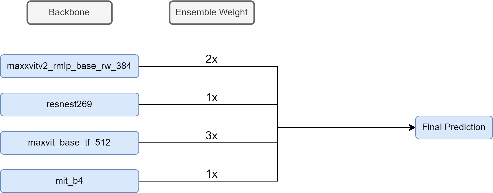

### Google Research - Contrails Competition

This repository contains code for the 58th place solution in the [Google Research - Identify Contrails to Reduce Global Warming](https://www.kaggle.com/competitions/google-research-identify-contrails-reduce-global-warming) competition on Kaggle. My solution write-up can be found [here](https://www.kaggle.com/competitions/google-research-identify-contrails-reduce-global-warming/discussion/430473).

<h1 align="center">

</h1>

### Improvements

Use a different seed for each model regardless of the validation fold
- Seed changes data loading and initial model weights (which will result in more different models for the ensemble)
- Ex. 1st place solution for [Feedback Prize - Predicting Effective Arguments Competition](https://www.kaggle.com/competitions/feedback-prize-effectiveness/discussion/347536)

Analyze model predictions
- Missed the 0.5 pixel shift that made TTA not work
- [5th Place Solution](https://www.kaggle.com/competitions/google-research-identify-contrails-reduce-global-warming/discussion/430549), [0.5 Pixel Shift Explanation](https://www.kaggle.com/competitions/google-research-identify-contrails-reduce-global-warming/discussion/430479#2382723)

More Creativity, Trust your findings
- Could have trained on each participant, or on soft labels [Discussionby @Ryches](https://www.kaggle.com/competitions/google-research-identify-contrails-reduce-global-warming/discussion/430471)
- I found that bicubic worked best in CV, but did not stick with it..
- The best tips are not always on the discussion forums

Use checkpointing during training
- Enables the usage of pausing and resuming training runs without wasting computation

Team up with other Kagglers.
- This is the best way to learn!

### Attempted

- Efficientnetv2, DPT
- Losses: Tversky, LogCoshDice
- Downsampling Interpolation Methods
- Removing Islands
- Openmmlab (Upernet, Swin)
- Deep supervision

### Positives

- Created a diverse ensemble using different backbones
- Attempted novel ideas (deep supervision, custom model architectures, etc)
- Iterated quickly with small-scale versions of images/models, and scaled up at the end
- First segmentation competition!